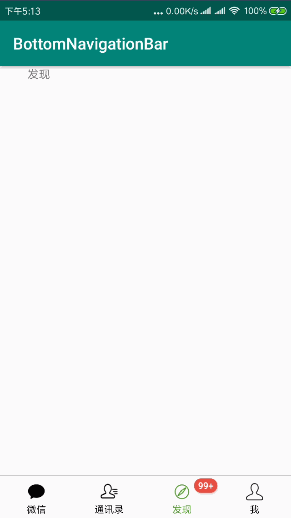

[](https://jitpack.io/#huangziye/BottomNavigationBar)


# Add ` BottomNavigationBar ` to project

- Step 1：Add the JitPack repository to your build file

Add it in your root build.gradle at the end of repositories:

```android
allprojects {
    repositories {
        ...
        maven { url 'https://jitpack.io' }
    }
}
```

- Step 2：Add the dependency

The latest version shall prevail.

```android
dependencies {
        implementation 'com.github.huangziye:BottomNavigationBar:${latest_version}'
}
```


# Effect picture





# Usage

```xml
<?xml version="1.0" encoding="utf-8"?>
<RelativeLayout
        xmlns:android="http://schemas.android.com/apk/res/android"
        xmlns:tools="http://schemas.android.com/tools"
        android:layout_width="match_parent"
        android:layout_height="match_parent"
        tools:context=".MainActivity">

    <androidx.viewpager.widget.ViewPager
            android:id="@+id/viewpager"
            android:layout_above="@+id/bottom_navigation"
            android:overScrollMode="never"
            android:layout_width="match_parent"
            android:layout_height="match_parent"/>

    <View android:layout_width="match_parent"
          android:layout_height="1px"
          android:layout_above="@+id/bottom_navigation"
          android:background="@android:color/darker_gray"/>

    <com.google.android.material.bottomnavigation.BottomNavigationView
            android:id="@+id/bottom_navigation"
            android:layout_width="match_parent"
            android:layout_height="56dp"
            android:layout_alignParentBottom="true"/>


</RelativeLayout>
```


```Kotlin
BottomNavigationBar.Companion.Builder().with(this)
    .bottomNavigationView(bottom_navigation)
    .viewpager(viewpager)
    .addMenuItem(R.id.action_wechat, getString(R.string.wechat), R.mipmap.ic_wechat)
    .addMenuItem(R.id.action_contact, getString(R.string.contact), R.mipmap.ic_contact)
    .addMenuItem(R.id.action_find, getString(R.string.find), R.mipmap.ic_find)
    .addMenuItem(R.id.action_me, getString(R.string.me), R.mipmap.ic_me)
    .notCanScroll(false)
    .addFragment(WechatFragment())
    .addFragment(ContactFragment())
    .addFragment(FindFragment())
    .addFragment(MeFragment())
    .build()
```

设置未读消息

```kotlin
BadgeView(this).bindTargetView(itemView).setBadgeCount(120)
    .setOnDragStateChangedListener(object : Badge.OnDragStateChangedListener {
        override fun onDragStateChanged(dragState: DragState, badge: Badge, targetView: View) {
            if (dragState == DragState.STATE_SUCCEED) {
                Toast.makeText(this@MainActivity, "success", Toast.LENGTH_SHORT).show()
            }
        }
    })
```


**BadegeView 方法说明**

| 方法	| 说明 |
| --- | --- |
| setBadgeCount | 设置Badge数字 |
| setBadgeText | 设置Badge文本 |
| setBadgeTextSize | 设置文本字体大小 |
| setBadgeTextColor | 设置文本颜色 |
| setExactMode | 设置是否显示精确模式数值 |
| setBadgeGravity | 设置Badge相对于TargetView的位置 |
| setGravityOffset | 设置外边距 |
| setBadgePadding | 设置内边距 |
| setBadgeBackgroundColor | 设置背景色 |
| setBadgeBackground | 设置背景图片 |
| setShowShadow | 设置是否显示阴影 |
| setOnDragStateChangedListener | 打开拖拽消除模式并设置监听 |
| stroke | 描边 |
| hide | 隐藏Badge |


# About me


- [简书](https://user-gold-cdn.xitu.io/2018/7/26/164d5709442f7342)

- [掘金](https://juejin.im/user/5ad93382518825671547306b)

- [Github](https://github.com/huangziye)


<br />
<br />

[reference](https://github.com/qstumn/BadgeView)

# License

```
Copyright 2018, huangziye

   Licensed under the Apache License, Version 2.0 (the "License");
   you may not use this file except in compliance with the License.
   You may obtain a copy of the License at

       http://www.apache.org/licenses/LICENSE-2.0

   Unless required by applicable law or agreed to in writing, software
   distributed under the License is distributed on an "AS IS" BASIS,
   WITHOUT WARRANTIES OR CONDITIONS OF ANY KIND, either express or implied.
   See the License for the specific language governing permissions and
   limitations under the License.
```


